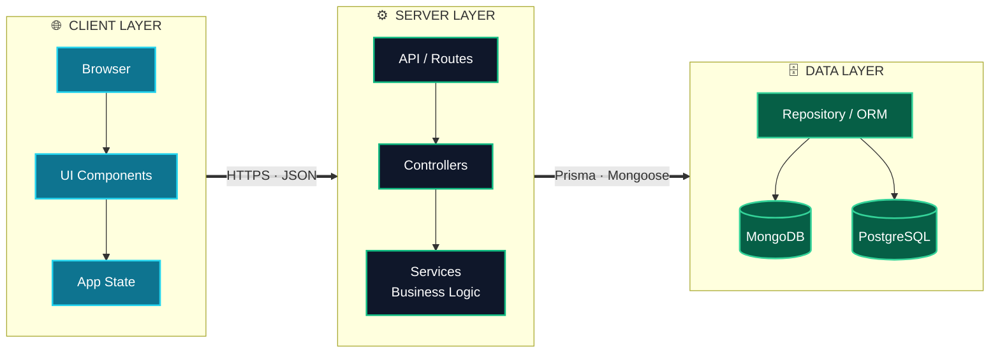

<!-- ╔══════════════════════════════════════════════════════════════╗ -->
<!-- ║                        HERO SECTION                          ║ -->
<!-- ╚══════════════════════════════════════════════════════════════╝ -->

<div align="center">


<a href="https://git.io/typing-svg">
  
</a>

<br/>


</div>

<br/>

<!-- ╔══════════════════════════════════════════════════════════════╗ -->
<!-- ║                         WHOAMI                               ║ -->
<!-- ╚══════════════════════════════════════════════════════════════╝ -->

 &nbsp;**`~/sujon $ whoami`**

```ts
const sujon: Engineer = {
  role:      "Full Stack Software Engineer",
  location:  "Rangpur, Bangladesh 🇧🇩",
  core:      ["MERN Stack", "TypeScript", "Next.js"],
  building:  "modern · scalable · maintainable · production-ready apps",
  loves:     ["complex problems", "reusable components",
              "robust APIs", "clean data models", "polished UX"],
  mindset:   "Ship simple code that survives production.",
  reachMe:   "sujon258549@gmail.com",
};
```

<br/>

<!-- ╔══════════════════════════════════════════════════════════════╗ -->
<!-- ║                      CONNECT                                 ║ -->
<!-- ╚══════════════════════════════════════════════════════════════╝ -->

<div align="center">

<a href="https://linkedin.com/in/sujon258549"></a>
<a href="mailto:sujon258549@gmail.com"></a>
<a href="https://github.com/mdsujon-dev"></a>

</div>

<br/>

 &nbsp;**`~/sujon $ cat tech-stack.json`**

<!-- ╔══════════════════════════════════════════════════════════════╗ -->
<!-- ║                     TECH ARSENAL                             ║ -->
<!-- ╚══════════════════════════════════════════════════════════════╝ -->

<table align="center" width="100%">
<tr>
<td width="50%" valign="top">

#### `01` &nbsp;Frontend


</td>
<td width="50%" valign="top">

#### `02` &nbsp;Backend


#### `03` &nbsp;Database


#### `04` &nbsp;Tooling


</td>
</tr>
</table>

<br/>

<!-- ╔══════════════════════════════════════════════════════════════╗ -->
<!-- ║                   WHAT I DO / EXPERTISE                      ║ -->
<!-- ╚══════════════════════════════════════════════════════════════╝ -->

 &nbsp;**`~/sujon $ ls -la expertise/`**

<table align="center" width="100%">
<tr>
<td align="center" width="25%"><h3>⚛️</h3><b>Frontend Architecture</b><br/><sub>App Router · Server Components · Reusable UI systems</sub></td>
<td align="center" width="25%"><h3>⚙️</h3><b>API Engineering</b><br/><sub>Controllers · Services · Middleware · Validation</sub></td>
<td align="center" width="25%"><h3>🗄️</h3><b>Data Modeling</b><br/><sub>Aggregation · Indexing · Relations · Migrations</sub></td>
<td align="center" width="25%"><h3>🔐</h3><b>Auth & Security</b><br/><sub>RBAC · Protected routes · Safe configuration</sub></td>
</tr>
<tr>
<td align="center"><h3>🎨</h3><b>Responsive UI</b><br/><sub>Accessible · Mobile-first · Design-system driven</sub></td>
<td align="center"><h3>⚡</h3><b>Performance</b><br/><sub>Caching · Query tuning · Bundle optimization</sub></td>
<td align="center"><h3>🔎</h3><b>Search & Filtering</b><br/><sub>Pagination · Sorting · Advanced query params</sub></td>
<td align="center"><h3>🧱</h3><b>Clean Architecture</b><br/><sub>Layered · Testable · Maintainable at scale</sub></td>
</tr>
</table>

<br/>

<!-- ╔══════════════════════════════════════════════════════════════╗ -->
<!-- ║                      ARCHITECTURE                            ║ -->
<!-- ╚══════════════════════════════════════════════════════════════╝ -->

 &nbsp;**`~/sujon $ ./render-architecture.sh`**



<br/>

<!-- ╔══════════════════════════════════════════════════════════════╗ -->
<!-- ║                    GITHUB METRICS                            ║ -->
<!-- ╚══════════════════════════════════════════════════════════════╝ -->

 &nbsp;**`~/sujon $ git stats --all`**

<div align="center">


</div>

<br/>

<!-- ╔══════════════════════════════════════════════════════════════╗ -->
<!-- ║                  ENGINEERING PRINCIPLES                      ║ -->
<!-- ╚══════════════════════════════════════════════════════════════╝ -->

 &nbsp;**`~/sujon $ cat principles.md`**

| | Principle | Why it matters |
|:---:|:---|:---|
| `01` | **Simple, readable, reusable code** | The next developer — often future me — ships faster. |
| `02` | **Separate UI, logic, and data access** | Changes stay local instead of rippling across the app. |
| `03` | **Validate every untrusted input** | Bad data never reaches the business layer. |
| `04` | **Protect sensitive endpoints** | Authorization is enforced server-side, always. |
| `05` | **Index frequent database queries** | Predictable performance as data grows. |
| `06` | **Consistent API responses** | Clients handle success and failure the same way, everywhere. |

<br/>

<!-- ╔══════════════════════════════════════════════════════════════╗ -->
<!-- ║                         FOOTER                               ║ -->
<!-- ╚══════════════════════════════════════════════════════════════╝ -->

<div align="center">


### Open to collaboration & new opportunities

<a href="mailto:sujon258549@gmail.com"></a>
<a href="https://linkedin.com/in/sujon258549"></a>

<br/><br/>


</div>
