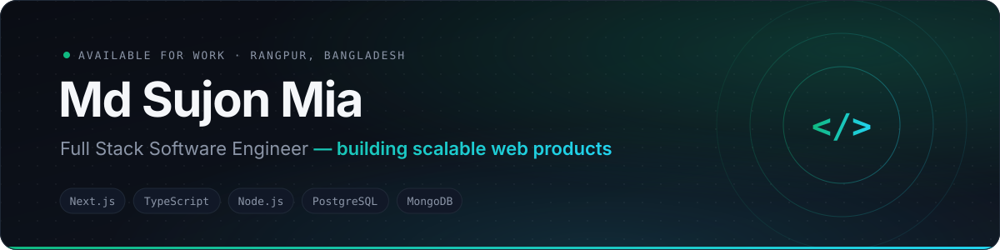

<picture>
  <source media="(prefers-color-scheme: dark)" srcset="./assets/banner-dark.svg" />
  <source media="(prefers-color-scheme: light)" srcset="./assets/banner-light.svg" />
  
</picture>

  
  
  

### About

I'm **Md Sujon Mia**, a **full stack software engineer** from Bangladesh. I design and ship production-ready web applications end to end, from pixel-perfect **Next.js** interfaces to secure **Node.js** APIs and well-modeled **PostgreSQL / MongoDB** databases.

> Ship simple code that survives production.

### Tech Stack

<picture>
  <source media="(prefers-color-scheme: light)" srcset="https://skillicons.dev/icons?i=ts,js,react,nextjs,tailwind,nodejs,express,mongodb,postgres,prisma,firebase,git,vercel&theme=light&perline=13" />
  
</picture>

### What I Do

<picture>
  <source media="(prefers-color-scheme: dark)" srcset="./assets/services-dark.svg" />
  <source media="(prefers-color-scheme: light)" srcset="./assets/services-light.svg" />
  
</picture>

### Analytics

  <picture>
    <source media="(prefers-color-scheme: light)" srcset="https://github-profile-summary-cards.vercel.app/api/cards/profile-details?username=mdsujon-dev&theme=default" />
    
  </picture>

  
  

  <picture>
    <source media="(prefers-color-scheme: light)" srcset="https://github-profile-summary-cards.vercel.app/api/cards/repos-per-language?username=mdsujon-dev&theme=default" />
    
  </picture>
  <picture>
    <source media="(prefers-color-scheme: light)" srcset="https://github-profile-summary-cards.vercel.app/api/cards/most-commit-language?username=mdsujon-dev&theme=default" />
    
  </picture>

 

  <b>Md Sujon Mia</b> · Full Stack Developer · MERN & Next.js Developer · Bangladesh 
  Have a project in mind? <a href="mailto:sujon258549@gmail.com">Let's talk →</a>

